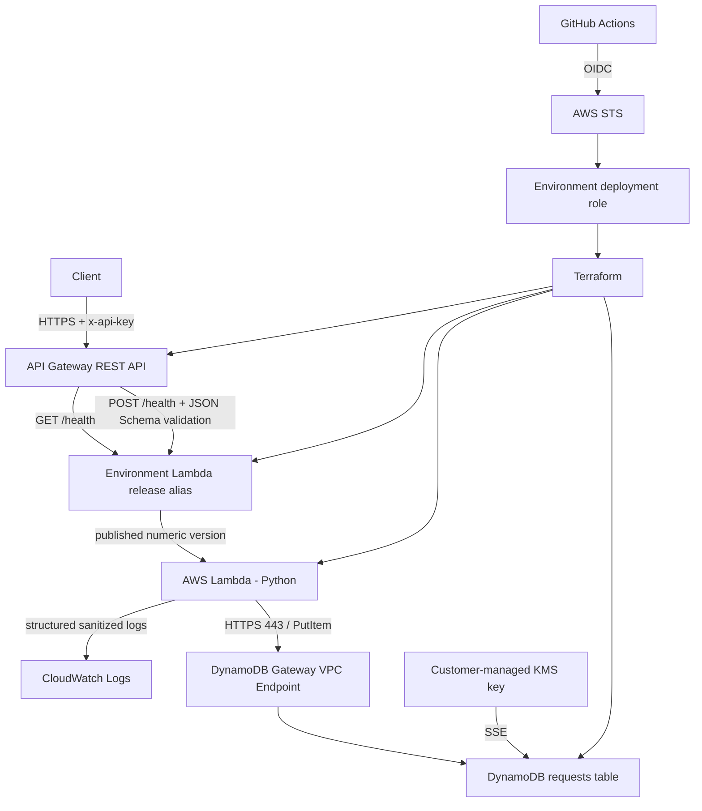

# Serverless Health Check API

DevOps/SRE candidate homework implementing a secure, Terraform-managed AWS serverless API with independent `staging` and `prod` environments.

The service exposes one API resource:

- `GET /health` — API-key protected, read-only liveness check.
- `POST /health` — API-key protected request-ingestion path. API Gateway validates the JSON body before Lambda, Lambda repeats the contract defensively, generates a UUID, stores request metadata in DynamoDB, and returns the required success response.

GitHub Actions deploys through short-lived AWS STS credentials obtained with GitHub OIDC. No long-lived AWS access key or API-key value is committed to the repository or supplied through Terraform variables.

For a requirement-by-requirement implementation map, see [`docs/REQUIREMENTS.md`](docs/REQUIREMENTS.md). Security assumptions and trust boundaries are documented in [`docs/THREAT_MODEL.md`](docs/THREAT_MODEL.md) and [`SECURITY.md`](SECURITY.md). Operational response and rollback procedures are in [`RUNBOOK.md`](RUNBOOK.md).

> **Evidence model:** repository source/configuration controls are considered implemented when present and covered by tests. Claims about live AWS state are considered proven only after the corresponding deployment verification succeeds. The latest completed `main` staging release has passed the full live gate; every later `main` revision must repeat it before being treated as releasable.

## Architecture



Lambda network path:

```text
Lambda
  -> dedicated security group
  -> HTTPS 443 to the AWS-managed DynamoDB prefix list only
  -> DynamoDB Gateway VPC Endpoint
  -> DynamoDB
```

The application VPC creates **no NAT Gateway and no Internet Gateway**.

## Design choices and assumptions

- **Terraform for AWS infrastructure:** application resources live under `terraform/`; the one-time OIDC/state/deployment-role bootstrap is also Terraform under `bootstrap/`.
- **REST API rather than API Gateway HTTP API:** REST API provides request models/validators, API keys, usage plans, and method throttling that directly satisfy this exercise.
- **POST for persisted requests:** the required `payload` belongs naturally in a request body. `GET` is provided separately as a conventional read-only health endpoint.
- **Defense-in-depth validation:** API Gateway rejects invalid POST requests before Lambda; Lambda repeats the contract in case it is invoked outside that boundary.
- **Immutable Lambda release path:** deployments publish a numeric Lambda version. `staging-release` or `prod-release` points at that version, and API Gateway invokes the alias rather than unqualified `$LATEST`.
- **OIDC instead of static AWS credentials:** GitHub exchanges its identity token for temporary AWS credentials scoped to the environment deployment role.
- **Private Lambda VPC:** the function only needs DynamoDB, so general Internet egress would add cost and attack surface without providing value.
- **Customer-managed KMS:** DynamoDB uses an environment-specific CMK with automatic rotation.
- **API-key limitation:** the API key satisfies the exercise and enables per-key throttling. It is not represented as strong end-user identity for a higher-risk production service.
- **No invented on-call integration:** CloudWatch alarms and a dashboard are provisioned, but no fake SNS/pager destination is claimed for this homework account.

## API contract

### GET `/health`

Requires the generated API key in `x-api-key` and performs no DynamoDB write.

Example response:

```json
{
  "status": "healthy",
  "message": "Service is available.",
  "version": "<git-commit-sha>"
}
```

### POST `/health`

Requires `x-api-key` and JSON:

```json
{
  "payload": "candidate-test"
}
```

The request contract is strict:

- `payload` is required;
- it must be a string;
- it must contain at least one non-whitespace character;
- default maximum length is 4096 characters;
- additional properties are rejected;
- the same API Gateway model is associated with `application/json` and `$default`, so changing `Content-Type` cannot bypass body validation;
- Lambda repeats the validation contract defensively;
- the Lambda handler is bound to `/health` and rejects a misrouted/direct event using another path before persistence.

Required successful POST response:

```json
{
  "status": "healthy",
  "message": "Request processed and saved."
}
```

The response also includes `X-Request-Id` for correlation.

A persisted record contains the generated UUID, UTC timestamp, TTL, HTTP method/path, payload, source IP, user agent, API Gateway request ID, and immutable application Git version.

## Request logging and sensitive-data handling

The assignment requires the incoming event to be logged. Lambda writes structured JSON logs, but known credential-bearing fields are sanitized before the event is serialized:

- `Authorization`;
- `x-api-key`;
- `Cookie`;
- `Proxy-Authorization`;
- common secret-bearing query parameters such as `token`, `api_key`, `access_token`, `password`, and `secret`;
- API Gateway REST `requestContext.identity.apiKey`.

Redaction operates on a deep copy so the original Lambda event is not mutated. API Gateway access logs intentionally omit request bodies and credential headers.

## Environment separation and naming

Environment-specific settings live in:

```text
terraform/environments/staging.tfvars
terraform/environments/prod.tfvars
```

Customer-controlled application names derive from `var.environment` and follow the requested `env-resource-name` convention wherever the AWS service allows hyphens.

Examples:

```text
staging-health-check-api
staging-health-check-function
staging-release
staging-health-check-function-role
staging-requests-db

prod-health-check-api
prod-health-check-function
prod-release
prod-health-check-function-role
prod-requests-db
```

Documented service-syntax/shared-infrastructure exceptions:

- API Gateway Model names must be alphanumeric, so they are `stagingHealthCheckRequest` / `prodHealthCheckRequest`.
- KMS aliases use the required `alias/` namespace.
- AWS-generated IDs and Lambda numeric versions are not customer-named resources.
- the Terraform state backend, GitHub OIDC provider, and regional API Gateway CloudWatch account role are shared bootstrap infrastructure; see [`bootstrap/README.md`](bootstrap/README.md).

## Repository layout

```text
.github/workflows/                reusable CI, CodeQL, staging/prod deployment workflows
bootstrap/                        OIDC, remote state, deployment roles, API Gateway logging bootstrap
docs/                             requirements mapping and threat model
lambda/                           Lambda handler, dependency manifests, unit tests
security/                         reviewed IAM wildcard exception catalogues
terraform/                        application Terraform root
terraform/environments/           staging/prod tfvars
terraform/modules/                network, runtime IAM, KMS, DynamoDB, Lambda, API, observability
terraform/tests/                  native Terraform security/invariant tests
scripts/package_lambda.py         deterministic Lambda package builder
scripts/check_iam_wildcards.py    machine-audited IAM wildcard policy guard
scripts/check_terraform_plan.py   destructive/security/resilience/release saved-plan guard
scripts/verify_deployment.py      shared live verification primitives
scripts/verify_staging_release.py deterministic full staging release gate
scripts/verify_prod_deployment.py non-load production verifier
scripts/verify_gateway_boundary.py API Gateway early-validation proof
scripts/verify_release_alias.py   immutable Lambda release and live-policy proof
tests/                            repository tooling/verifier/CI invariant tests
RUNBOOK.md                        SRE incident, diagnosis, recovery, rollback guidance
```

## Prerequisites

- AWS account.
- Permission to perform the one-time bootstrap from an authenticated administrative/local AWS CLI session.
- AWS CLI.
- Terraform `1.16.x`.
- Python `3.13+` for repository tooling/tests. Lambda runtime is Python `3.14`.
- GitHub repository `eimisse/serverless-health-check-api`.
- GitHub Environments named exactly `staging` and `prod`.

Default AWS region: `eu-west-1`.

## One-time AWS bootstrap

GitHub cannot assume its deployment role until the OIDC trust and role exist, so bootstrap is intentionally separate from application state.

Confirm the intended AWS account before any write:

```bash
aws sts get-caller-identity
```

Then initialize, review, and apply the bootstrap locally:

```bash
terraform -chdir=bootstrap init -backend=false
terraform -chdir=bootstrap fmt -check
terraform -chdir=bootstrap validate
terraform -chdir=bootstrap plan -out=bootstrap.tfplan
terraform -chdir=bootstrap show bootstrap.tfplan
terraform -chdir=bootstrap apply bootstrap.tfplan
terraform -chdir=bootstrap output -json
```

Bootstrap manages:

- the account-wide GitHub Actions OIDC provider, or the documented existing-provider reuse path;
- private, versioned, KMS-encrypted S3 Terraform state;
- native S3 state locking;
- separate staging/prod OIDC deployment roles;
- scoped deployment policies;
- the regional API Gateway CloudWatch logging role/account setting.

If an apply stops part-way through, preserve the bootstrap state, inspect owned resources, create a fresh saved plan, and reconcile only the exact intended resources. Do not delete broad infrastructure simply to make the next apply look clean. See [`bootstrap/README.md`](bootstrap/README.md).

## GitHub OIDC trust

This repository uses GitHub's immutable repository/owner identity format in the AWS trust policy. Bootstrap pins the stable owner and repository IDs as well as the readable names.

The deployment trust additionally requires:

- `aud = sts.amazonaws.com`;
- the exact immutable repository subject;
- the matching `staging` or `prod` GitHub Environment;
- exact repository and owner IDs;
- `ref = refs/heads/main`.

The deployment jobs independently require `github.ref == 'refs/heads/main'`.

## GitHub Environment configuration

Create environments named exactly:

```text
staging
prod
```

Populate these **GitHub Environment variables** from bootstrap outputs:

| Variable | Source / purpose |
| --- | --- |
| `AWS_REGION` | deployment region, normally `eu-west-1` |
| `AWS_DEPLOY_ROLE_ARN` | environment-specific OIDC deployment role |
| `TF_STATE_BUCKET` | remote Terraform state bucket |
| `TF_STATE_KMS_KEY_ARN` | KMS key used by the Terraform backend |

No `AWS_ACCESS_KEY_ID` or `AWS_SECRET_ACCESS_KEY` GitHub secret is required or expected.

Configure deployment branch/tag protection to allow `main` only. For `prod`, also configure **required reviewers**. The workflow intentionally does not claim this GitHub UI protection exists until it is actually configured.

## Manual Terraform environment selection

Build the Lambda package first:

```bash
python scripts/package_lambda.py
```

After initializing the appropriate backend, the same Terraform root selects an environment through the requested `.tfvars` pattern:

```bash
terraform -chdir=terraform plan \
  -var-file=environments/staging.tfvars \
  -var="application_version=$(git rev-parse HEAD)" \
  -out=tfplan

terraform -chdir=terraform apply tfplan
```

Production uses `environments/prod.tfvars` and its own remote-state key. CI generates backend configuration from protected GitHub Environment variables rather than committing account-specific backend values.

## CI/CD

### Credential-free CI

`.github/workflows/ci.yml` runs without AWS deployment credentials and is also reusable through `workflow_call`. It contains the pre-deployment quality/security gates:

```text
Python compilation
Lambda unit tests
repository tooling/verifier/CI-invariant unit tests
deterministic Lambda package build
Terraform fmt / init -backend=false / validate
native terraform test
bootstrap validate
TFLint
IAM wildcard audit
Bandit SAST
pip-audit for production and pinned development manifests
Checkov application + bootstrap
Trivy IaC + secret scanning
actionlint
zizmor
```

The reusable CI workflow has no `id-token: write` permission and does not configure AWS credentials.

### CodeQL

CodeQL is intentionally a **separate** SHA-pinned workflow in `.github/workflows/codeql.yml`. It runs for pull requests/main-branch validation and on its configured schedule. This keeps code-scanning permissions separate from deployment credentials and from the reusable CI job.

### Staging deployment

A push to `main` triggers `.github/workflows/deploy-staging.yml`. Manual dispatch is also available, but the AWS deployment job is guarded to `refs/heads/main`.

The staging flow is split across a security boundary:

1. a **credential-free `quality-gate` job** calls the reusable `ci.yml` workflow;
2. only after that entire gate succeeds can the environment deployment job start;
3. only the deployment job receives `id-token: write` and staging Environment variables;
4. GitHub OIDC is exchanged for short-lived credentials for the staging deployment role;
5. the job verifies the assumed AWS account;
6. a read-only live preflight exercises the deployment-role/provider refresh paths before Terraform plan/apply;
7. Terraform initializes KMS-encrypted remote state with native S3 locking;
8. Terraform creates a saved plan using `environments/staging.tfvars` and the current `GITHUB_SHA`;
9. `scripts/check_terraform_plan.py` audits destructive changes and critical security/resilience/release invariants;
10. the workflow applies **exactly that saved plan**;
11. the AWS-generated API key is retrieved only for verification and immediately masked;
12. `scripts/verify_staging_release.py` proves GET/POST behavior, DynamoDB persistence/encryption, KMS rotation, VPC isolation, exact DynamoDB-only SG egress, API-key rejection, log redaction, and the live API Gateway stage/usage-plan throttling configuration;
13. release verification proves `${environment}-release` points to a published numeric Lambda version for the expected Git commit and audits its live invoke policy;
14. boundary verification proves invalid Content-Type and whitespace-only requests are rejected before Lambda;
15. a second Terraform plan must report zero drift.

The throttling release gate intentionally reads the effective AWS control-plane values rather than requiring a synthetic burst to produce a `429`: API Gateway throttling is a best-effort target, so a one-shot timing-sensitive 429 assertion is not a deterministic deployment criterion.

### Production deployment

`.github/workflows/deploy-prod.yml` is `workflow_dispatch` only and requires `main`. Production is not deployed merely to demonstrate this homework.

The production flow is deliberately stricter than a simple manual Terraform apply:

1. the credential-free reusable quality/security gate must pass;
2. a separate credential-free job queries GitHub Actions and requires a successful **push-triggered staging deployment for the exact same `GITHUB_SHA`**;
3. only then can the `prod` GitHub Environment deployment job become eligible to start;
4. configure the `prod` GitHub Environment with **required reviewers** so approval happens before protected environment variables and the OIDC token become available;
5. OIDC assumes the dedicated production deployment role and a live read preflight runs before planning;
6. the workflow captures the current `prod-release` numeric Lambda version and its immutable `APP_VERSION` as an emergency rollback target;
7. Terraform creates, guards, and applies an exact saved production plan;
8. non-load production functionality, release-alias, gateway-boundary and zero-drift verification run;
9. if apply starts and the deployment subsequently fails, the workflow restores the previous `prod-release` alias when one exists and verifies both the restored numeric version and its `APP_VERSION`.

The automatic alias restoration is a fail-safe, not a claim of zero-impact/two-phase deployment. A failed Terraform apply may already have changed other resources. Emergency alias rollback therefore intentionally leaves desired-state drift that must be reconciled through the normal reviewed Git/Terraform flow before a later promotion.

## Lambda packaging and immutable versioning

The deployment does not route production traffic to unqualified `$LATEST`.

```text
Git commit SHA
  -> deterministic build/lambda.zip
  -> source_code_hash
  -> Lambda publish = true
  -> immutable numeric Lambda version
  -> staging-release / prod-release alias
  -> alias-qualified API Gateway integration
```

Lambda invoke permissions are alias-qualified and scoped to the exact environment stage, GET/POST method, and `/health` path.

The saved-plan guard rejects release regressions such as `$LATEST`, an unqualified integration, or a lost alias qualifier. Live release verification additionally checks AWS `GetAlias`, the numeric version, `APP_VERSION == GITHUB_SHA`, and the alias resource policy. The live alias must expose exactly the intended GET and POST API Gateway permissions.

Terraform outputs include the function and release metadata needed for operations, including the environment release alias and current published version.

### Rollback

The normal supported rollback is GitOps-controlled:

1. identify/revert to the last known-good source/configuration through normal review;
2. CI rebuilds the deterministic package and reruns all security/quality gates;
3. review the new saved Terraform plan;
4. apply that exact plan;
5. Terraform publishes the release state and moves the environment alias;
6. live verification confirms the user path, alias and Git release identity;
7. require zero post-deployment drift.

API Gateway does not need to be manually repointed during the normal rollback path.

Production additionally has the workflow-level emergency `prod-release` alias fail-safe described above. It minimizes exposure to a bad Lambda release when a deployment fails after apply starts, but it does not roll back arbitrary Terraform changes. After that fail-safe runs, the deployment is still failed: inspect the partial change set, revert/fix source, review a fresh plan, and reconcile to zero drift before the next promotion.

## Retrieve the generated API key

Terraform manages the API-key resource and outputs its ID. The value is AWS-generated and retrieved only when an authorized smoke/integration test needs it.

```bash
API_URL="$(terraform -chdir=terraform output -raw api_url)"
API_KEY_ID="$(terraform -chdir=terraform output -raw api_key_id)"
API_KEY="$(aws apigateway get-api-key \
  --api-key "${API_KEY_ID}" \
  --include-value \
  --query value \
  --output text)"
```

Treat `API_KEY` as sensitive. Deployment workflows mask it immediately before using it.

## Curl examples

Read-only health check:

```bash
curl -i \
  -H "x-api-key: ${API_KEY}" \
  "${API_URL}/health"
```

Persist a valid request:

```bash
curl -i \
  -X POST \
  -H "x-api-key: ${API_KEY}" \
  -H "Content-Type: application/json" \
  -d '{"payload":"candidate-test"}' \
  "${API_URL}/health"
```

Missing API key — expected `403`:

```bash
curl -i "${API_URL}/health"
```

Missing payload — expected `400`:

```bash
curl -i \
  -X POST \
  -H "x-api-key: ${API_KEY}" \
  -H "Content-Type: application/json" \
  -d '{}' \
  "${API_URL}/health"
```

Whitespace-only payload — expected `400` before Lambda:

```bash
curl -i \
  -X POST \
  -H "x-api-key: ${API_KEY}" \
  -H "Content-Type: application/json" \
  -d '{"payload":"   "}' \
  "${API_URL}/health"
```

## IAM and least privilege

Runtime and deployment privileges are intentionally separate.

### Lambda runtime role

The function receives only:

- `dynamodb:PutItem` on the exact environment table;
- `logs:CreateLogStream` and `logs:PutLogEvents` on the exact application log-group streams;
- the exact EC2 network-interface lifecycle actions required by VPC-enabled Lambda.

The EC2 VPC control-plane actions require `Resource = "*"` because the network interfaces do not yet exist when Lambda creates them. Those actions are explicitly enumerated and machine-reviewed. The function code is explicitly denied from reusing those EC2 actions through `lambda:SourceFunctionArn`.

The DynamoDB CMK policy separately permits the exact runtime role only the KMS operations needed through the DynamoDB service path and exact table/account encryption context. `kms:CreateGrant` is not granted to the Lambda runtime role; grant/table lifecycle remains with the deployment role under a service-constrained statement.

### Deployment roles

Staging and prod use separate GitHub OIDC deployment roles. Permissions are split into focused policies and constrained to environment resource names/ARNs where AWS supports resource-level authorization.

`Action = "*"` is absolutely prohibited. Service-level action wildcards such as `kms:*` are also rejected. Mandatory resource wildcards are documented in machine-readable catalogues under [`security/`](security/) and checked by `scripts/check_iam_wildcards.py`.

## DynamoDB durability and encryption

The requests table uses:

- `PAY_PER_REQUEST` billing;
- string partition key `request_id`;
- Server-Side Encryption with an environment-specific customer-managed KMS key;
- KMS automatic rotation;
- point-in-time recovery;
- TTL on `expires_at`;
- production deletion protection.

The saved-plan guard rejects regressions in the critical persistence controls before apply.

## Throttling and abuse controls

The API always uses two explicit API Gateway controls:

1. method/stage rate and burst limits;
2. API-key usage-plan rate and burst limits.

Production also has explicit Lambda reserved concurrency. Staging intentionally uses the account-shared Lambda concurrency pool because a very small reservation would violate the account's minimum unreserved-concurrency requirement; the required API Gateway throttling controls remain active.

The staging release verifier deterministically reads the live API Gateway stage/usage plan and requires the exact configured GET/POST rate/burst values, detailed method metrics, exact API/stage association and generated API-key association. It deliberately does not require one synthetic burst to produce `429`, because API Gateway throttling is a best-effort target and that observation is timing-sensitive.

These are rate/capacity controls rather than a claim of complete Internet DDoS protection. For a higher-risk real service, AWS WAF/Shield and stronger caller identity would be evaluated separately.

## Observability

Each environment includes:

- structured sanitized Lambda application logs;
- structured API Gateway access logs without request bodies/credential headers;
- finite log retention;
- Lambda error and throttle alarms;
- API Gateway 5XX alarm;
- API Gateway p95 latency alarm;
- a focused CloudWatch dashboard.

For troubleshooting sequence, signal interpretation, failed-apply recovery, drift handling, and rollback, see [`RUNBOOK.md`](RUNBOOK.md).

## Pre-apply and drift safety

Before apply, `scripts/check_terraform_plan.py` rejects, among other things:

- unapproved destructive changes;
- missing DynamoDB KMS encryption;
- disabled PITR/TTL;
- production deletion-protection regression;
- incorrect PAY_PER_REQUEST/key invariants;
- missing Lambda VPC/concurrency/version publishing invariants;
- release alias regression to `$LATEST`;
- API Gateway integration not bound to the environment release alias;
- loss of API-key enforcement;
- weakened request model/validator;
- removed stage/usage-plan throttling or metrics;
- broadened/unqualified Lambda invoke permission.

The deployment applies exactly the saved plan that passed this guard. A second plan after deployment must return zero drift.

## Local validation

Core checks that do not require deployment credentials:

```bash
python -m compileall -q lambda scripts tests
python -m unittest discover -s lambda/tests -p 'test_*.py' -v
python -m unittest discover -s tests -p 'test_*.py' -v
python scripts/package_lambda.py
python scripts/check_iam_wildcards.py

terraform fmt -check -diff -recursive
terraform -chdir=terraform init -backend=false
terraform -chdir=terraform validate
terraform -chdir=terraform test -no-color
terraform -chdir=bootstrap init -backend=false
terraform -chdir=bootstrap validate
```

CI adds TFLint, Bandit, pip-audit, Checkov, Trivy, actionlint, zizmor, and the separate CodeQL workflow.

## Failure recovery

If a failed deployment creates or changes an AWS object before Terraform safely completes:

1. stop blind automatic/manual retries;
2. identify the exact AWS resource and Terraform address;
3. inspect the correct environment remote state and live resource;
4. determine exactly what the failed apply changed;
5. reconcile/import only the intended resource if appropriate;
6. generate a fresh saved plan;
7. review it before any apply.

Do not use broad deletion or weaken security gates to make the next deployment pass.

For production, the workflow's emergency alias rollback can restore the previous immutable Lambda release after apply starts and a failure occurs, but it does not replace the Terraform reconciliation steps above for other partially applied resources.

The source of truth is reviewed Terraform configuration plus environment-specific remote state, not ad-hoc console changes.

## Cleanup

Destroy an application environment only with the same environment tfvars and backend/state that own it. Review the destroy plan before apply. Production DynamoDB deletion protection must be intentionally changed in reviewed source before the table can be removed.

The shared state bucket has `prevent_destroy`; bootstrap cleanup is therefore a separate, deliberate operation performed only after state has been securely preserved or migrated.

## Cost awareness

The design avoids NAT Gateway, WAF, provisioned DynamoDB capacity, and unnecessary Lambda runtime dependencies. DynamoDB uses on-demand billing. Expected billable components are normal API Gateway/Lambda/DynamoDB/KMS/CloudWatch usage plus state/log retention.

## Live verification status

The repository deliberately distinguishes source correctness from deployed evidence. Static/unit/Terraform/security checks prove the repository contract without AWS credentials; live AWS claims require the staging deployment verification workflow.

A complete staging deployment on `main` has passed the full release gate. Proven staging evidence includes:

- GitHub OIDC assuming only the staging deployment role and matching the expected AWS account;
- live deployment-role preflight before Terraform plan/apply;
- the guarded saved plan applying successfully;
- `staging-release` targeting a published numeric Lambda version for the expected Git SHA;
- GET `/health` returning the expected release identity;
- POST `/health` returning the required success body and persisting/correlating the request in DynamoDB;
- invalid/missing/whitespace payloads returning `400`, with boundary probes proving selected invalid requests do not reach Lambda;
- missing/wrong API key returning `403`;
- DynamoDB SSE using the expected CMK, PITR/TTL enabled, and KMS rotation enabled;
- Lambda isolated in exactly two private subnets with no NAT/IGW;
- Lambda SG exposing exactly one outbound rule: TCP/443 only to the regional DynamoDB managed prefix list, with no CIDR/IPv6/security-group destination;
- exact live GET/POST stage throttling, detailed metrics, usage-plan throttling, API/stage association and API-key association;
- post-deployment Terraform reporting zero drift.

Any later change to `main` must pass the same staging workflow before it becomes eligible for production promotion. Production remains manual-only and should not be deployed merely to demonstrate this homework unless explicitly required.
