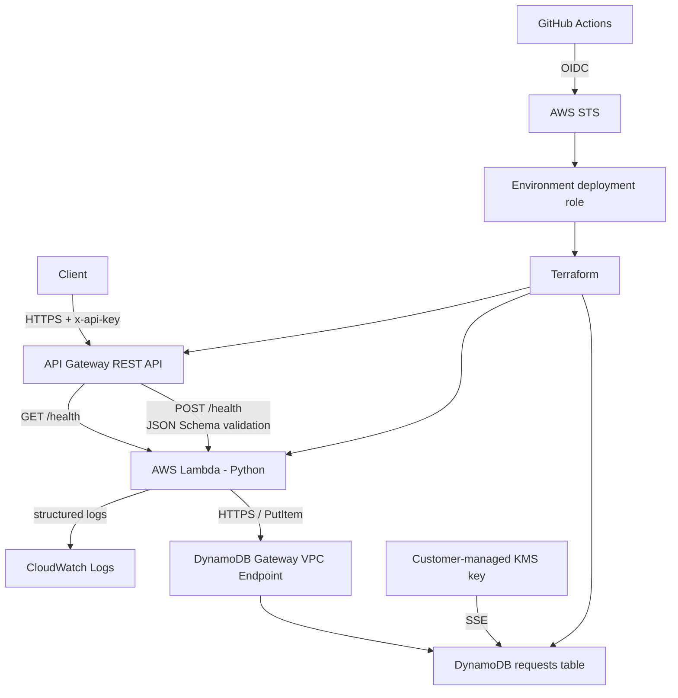

# Serverless Health Check API

DevOps/SRE candidate homework implementing a secure, Terraform-managed AWS serverless API with separate `staging` and `prod` environments.

The application exposes one resource, `/health`:

- `GET /health` is an API-key protected, read-only service health check.
- `POST /health` is API-key protected, validates a strict JSON body before Lambda, writes a unique request record to DynamoDB, and returns the required success response.

GitHub Actions deploys with short-lived AWS credentials through OIDC. No long-lived AWS access keys or API-key values are committed or stored in Terraform variables.

For a direct assignment-to-code mapping, see [`docs/REQUIREMENTS.md`](docs/REQUIREMENTS.md). The security model is summarized in [`docs/THREAT_MODEL.md`](docs/THREAT_MODEL.md) and [`SECURITY.md`](SECURITY.md).

## Architecture



Network path for Lambda:

```text
Lambda
  -> dedicated security group
  -> HTTPS 443 to AWS-managed DynamoDB prefix list only
  -> DynamoDB Gateway VPC Endpoint
  -> DynamoDB

No NAT Gateway and no Internet Gateway are created in the application VPC.
```

## Design choices

- **REST API instead of HTTP API:** request models/validators, API keys, usage plans, and method throttling are directly useful for this exercise.
- **POST for persisted health requests:** the required `payload` body naturally belongs to POST.
- **GET in addition to POST:** provides a conventional read-only liveness endpoint without writing a synthetic database record.
- **Defense-in-depth validation:** API Gateway rejects invalid POST bodies before Lambda, while Lambda repeats validation in case it is invoked outside that boundary.
- **OIDC instead of AWS secrets:** GitHub exchanges an identity token for temporary AWS STS credentials.
- **Private Lambda VPC without NAT:** the function only needs DynamoDB, so general Internet egress would add cost and attack surface.
- **Customer-managed KMS:** demonstrates explicit encryption ownership, rotation, and scoped key policy.
- **API key caveat:** the API key fulfills the exercise requirement and enables usage-plan controls; it is not presented as strong end-user identity authentication for a high-risk production service.

## API behavior

### GET /health

Requires the generated key in `x-api-key` and performs no DynamoDB write.

```json
{
  "status": "healthy",
  "message": "Service is available.",
  "version": "<git-commit-sha>"
}
```

### POST /health

Requires `x-api-key` and a JSON body:

```json
{
  "payload": "candidate-test"
}
```

The request contract is strict:

- `payload` is required;
- it must be a non-empty string containing at least one non-whitespace character;
- default maximum length is 4096 characters;
- additional properties are rejected;
- the same API Gateway model is attached to `application/json` and `$default`, preventing a caller from bypassing validation by changing `Content-Type`;
- Lambda repeats all important validation checks.

Successful POST response:

```json
{
  "status": "healthy",
  "message": "Request processed and saved."
}
```

The response also carries `X-Request-Id`. DynamoDB stores the generated request ID, UTC timestamp, TTL, method/path, payload, source metadata, API request ID, and immutable application commit version. Authentication headers are not persisted.

## Environment separation and naming

Application resources derive their names from `var.environment`:

```text
staging-health-check-api
staging-health-check-function
staging-health-check-function-role
staging-requests-db

prod-health-check-api
prod-health-check-function
prod-health-check-function-role
prod-requests-db
```

Environment-specific settings live in:

```text
terraform/environments/staging.tfvars
terraform/environments/prod.tfvars
```

The application stacks follow the requested `env-resource-name` convention. A few one-time bootstrap resources are deliberately shared/account-wide (Terraform state backend, GitHub OIDC provider, and the regional API Gateway CloudWatch account role); these architectural exceptions are explicitly explained in [`bootstrap/README.md`](bootstrap/README.md).

## Repository layout

```text
.github/workflows/             CI, CodeQL, staging and production deploy workflows
bootstrap/                     one-time AWS OIDC/state/deployment-role bootstrap
docs/                          requirements mapping and threat model
lambda/                        Lambda handler, manifests and unit tests
security/                      reviewed IAM wildcard exception catalogues
terraform/                     application Terraform root
terraform/environments/        staging/prod tfvars
terraform/modules/             network, IAM, KMS, DynamoDB, Lambda, API, observability
terraform/tests/               native Terraform security/invariant tests
scripts/package_lambda.py      deterministic Lambda ZIP builder
scripts/check_iam_wildcards.py machine-audited IAM wildcard policy
scripts/check_terraform_plan.py destructive/security Terraform plan guard
scripts/verify_deployment.py   live staging functionality/security verifier
scripts/verify_prod_deployment.py non-load production verifier
```

## Prerequisites

- AWS account and permission to perform the one-time bootstrap.
- AWS CLI authenticated to the intended account for bootstrap/local administration.
- Terraform `1.16.x`.
- Python `3.13+` for repository tooling/tests. Lambda runs on Python `3.14`.
- GitHub repository `eimisse/serverless-health-check-api`.
- GitHub Environments named exactly `staging` and `prod`.

Default AWS region is `eu-west-1`.

## One-time AWS bootstrap

GitHub cannot assume a deployment role before that trust exists, so bootstrap is intentionally separate from the application state.

First confirm the target account:

```bash
aws sts get-caller-identity
```

Then create a reviewed saved plan:

```bash
terraform -chdir=bootstrap init -backend=false
terraform -chdir=bootstrap fmt -check
terraform -chdir=bootstrap validate
terraform -chdir=bootstrap plan -out=bootstrap.tfplan
terraform -chdir=bootstrap show bootstrap.tfplan
terraform -chdir=bootstrap apply bootstrap.tfplan
terraform -chdir=bootstrap output -json
```

Bootstrap creates or reuses:

- the account-wide GitHub Actions OIDC provider;
- encrypted/versioned/private S3 Terraform state storage;
- a rotating CMK for state encryption;
- separate staging/prod deployment roles;
- the regional API Gateway CloudWatch logging role/account setting.

If the GitHub OIDC provider already exists, use the reuse procedure in [`bootstrap/README.md`](bootstrap/README.md).

## GitHub OIDC security

This repository was created after GitHub's 2026-07-15 immutable OIDC-subject rollout, so bootstrap pins the stable owner/repository IDs:

```text
owner:      eimisse@58630165
repository: serverless-health-check-api@1349307973
```

The deployment trust additionally requires:

- `aud = sts.amazonaws.com`;
- the exact immutable repository subject;
- the matching `staging` or `prod` environment;
- exact repository and owner IDs;
- `ref = refs/heads/main`.

The deploy jobs independently check `github.ref == 'refs/heads/main'`.

## Configure GitHub Environments

Create environments named:

```text
staging
prod
```

Copy bootstrap outputs into environment variables:

| GitHub Environment variable | Source |
| --- | --- |
| `AWS_REGION` | bootstrap region, normally `eu-west-1` |
| `AWS_DEPLOY_ROLE_ARN` | matching entry in `deployment_role_arns` |
| `TF_STATE_BUCKET` | `state_bucket_name` |
| `TF_STATE_KMS_KEY_ARN` | `state_kms_key_arn` |

Do **not** add `AWS_ACCESS_KEY_ID` or `AWS_SECRET_ACCESS_KEY` GitHub secrets.

For both environments, configure GitHub deployment branch/tag protection to allow **`main` only**. For `prod`, also configure **required reviewers**. The workflow deliberately does not claim this UI protection exists until it is actually configured.

## Manual Terraform environment selection

The same root is parameterized for both environments. After building the Lambda package and initializing the appropriate backend, a specific environment is selected with its `.tfvars` file, for example:

```bash
python scripts/package_lambda.py

terraform -chdir=terraform init \
  -backend-config=/secure/path/staging.backend.hcl

terraform -chdir=terraform plan \
  -var-file=environments/staging.tfvars \
  -var="application_version=$(git rev-parse HEAD)" \
  -out=tfplan

terraform -chdir=terraform apply tfplan
```

Production uses `environments/prod.tfvars` and a different remote-state key. The CI/CD workflows generate the backend configuration from protected GitHub Environment variables so no account-specific backend values need to be committed.

## CI/CD flow

### Pull request / validation

The CI workflow is designed to run without AWS deployment credentials and includes:

```text
Python compile + unit tests
Terraform fmt / init -backend=false / validate / native tests
TFLint
IAM wildcard audit
Bandit
pip-audit (production + development manifests)
Checkov
Trivy IaC + secret scan
actionlint
zizmor
CodeQL
```

Critical security checks are blocking; there is no `continue-on-error` bypass for the deployment security gates.

During active work on `submission`, heavyweight CI/CodeQL is intentionally not triggered for every small commit. It remains manually runnable and is run at the final validation checkpoint/PR path.

### Staging

After reviewed code reaches `main`, `.github/workflows/deploy-staging.yml`:

1. validates required GitHub Environment configuration;
2. compiles and unit-tests the code;
3. builds the deterministic Lambda release and records its SHA-256;
4. validates Terraform and runs native tests;
5. runs IAM, Python, dependency, IaC and secret security gates **before AWS credentials are requested**;
6. assumes only the staging deployment role using GitHub OIDC;
7. verifies the assumed AWS account against the configured role ARN;
8. initializes KMS-encrypted staging remote state with native S3 locking;
9. creates a saved Terraform plan;
10. converts the plan to JSON and runs the destructive/security plan guard;
11. applies exactly the reviewed saved plan;
12. retrieves and masks the AWS-generated API key for smoke tests;
13. verifies live API, DynamoDB, KMS, logging, API-key rejection, early validation and VPC isolation;
14. runs a small staging-only throttling probe;
15. verifies zero Terraform drift after deployment.

### Production

`.github/workflows/deploy-prod.yml` is manual (`workflow_dispatch`) only, requires `main`, uses the separate `prod` environment/role/state key, and is intended to sit behind GitHub Environment required-reviewer approval. Its live verifier does not run the staging load/throttling probe.

## Retrieve the generated API key

Terraform outputs the API key **ID**, not a configured secret value. AWS generates the key when the resource is created.

```bash
API_URL="$(terraform -chdir=terraform output -raw api_url)"
API_KEY_ID="$(terraform -chdir=terraform output -raw api_key_id)"
API_KEY="$(aws apigateway get-api-key \
  --api-key "$API_KEY_ID" \
  --include-value \
  --query value \
  --output text)"
```

Treat `API_KEY` as a secret. The deployment workflow masks it immediately before using it for smoke tests.

## Curl examples

Read-only health check:

```bash
curl -i \
  -H "x-api-key: ${API_KEY}" \
  "${API_URL}/health"
```

Persist a valid request:

```bash
curl -i \
  -X POST \
  -H "x-api-key: ${API_KEY}" \
  -H "Content-Type: application/json" \
  -d '{"payload":"candidate-test"}' \
  "${API_URL}/health"
```

Missing API key (expected `403`):

```bash
curl -i "${API_URL}/health"
```

Invalid body (expected `400`):

```bash
curl -i \
  -X POST \
  -H "x-api-key: ${API_KEY}" \
  -H "Content-Type: application/json" \
  -d '{}' \
  "${API_URL}/health"
```

## IAM and least privilege

Lambda runtime and deployment privileges are intentionally separate.

### Lambda runtime role

The function receives only:

- `dynamodb:PutItem` on the exact environment table;
- `logs:CreateLogStream` / `logs:PutLogEvents` on its exact log group streams;
- the exact EC2 network-interface lifecycle actions required for VPC-enabled Lambda.

The EC2 VPC lifecycle APIs are a documented mandatory `Resource = "*"` exception because the network interfaces do not exist when Lambda creates them. The function code is explicitly denied from using those EC2 actions through `lambda:SourceFunctionArn`.

### Deployment roles

Staging and prod have separate OIDC roles. Permissions are split into narrow statements for the exact application resource names/ARN families. AWS APIs that genuinely do not support resource-level authorization are isolated into explicit statements with conditions and machine-reviewed exception entries.

`Action = "*"` is prohibited.

Reviewed wildcard exceptions live in [`security/`](security/) and are enforced by `scripts/check_iam_wildcards.py`.

## Encryption and data protection

- DynamoDB uses Server-Side Encryption with an environment-specific customer-managed KMS key.
- KMS rotation is enabled.
- DynamoDB point-in-time recovery is enabled.
- request records use TTL.
- prod DynamoDB deletion protection is enabled.
- Terraform state is KMS-encrypted, versioned, TLS-enforced and blocked from public access.

## Logging and observability

Each environment includes:

- structured Lambda application logs;
- sanitized incoming-event logging with `Authorization`, `x-api-key`, `Cookie`, and `Proxy-Authorization` redacted;
- structured API Gateway access logs without request body or credential headers;
- finite log retention;
- Lambda error and throttle alarms;
- API Gateway 5XX and p95 latency alarms;
- a focused CloudWatch dashboard.

Alarms intentionally have no external paging target because this homework has no real on-call integration. The repository does not pretend that an alert destination exists.

## Security verification

Static and live controls are intentionally paired. Examples:

| Requirement / threat | Control | Evidence |
| --- | --- | --- |
| invalid POST | API Gateway schema + Lambda validation | native Terraform tests, unit tests, live 400 checks |
| Content-Type validation bypass | `$default` request model | Terraform security test + boundary verifier |
| API abuse | API key, usage plan, stage throttle, Lambda concurrency | Terraform tests + staging-only 429 probe |
| credential leakage | log redaction | unit tests + live CloudWatch inspection |
| broad IAM | scoped policies + wildcard exception catalogue | IAM audit |
| data at rest | DynamoDB CMK | live `DescribeTable` and KMS rotation verification |
| Internet egress | private VPC, no NAT/IGW, DynamoDB endpoint | Terraform tests + live EC2 verification |
| unsafe apply | saved plan + destructive/security plan guard | plan JSON audit + exact-plan apply |
| deployment credential theft | immutable GitHub OIDC trust | bootstrap trust policy + STS account verification |

## Failure recovery

If a failed first deployment creates a named AWS resource before state ownership is safely recorded, do not blindly retry or delete broad infrastructure. Identify the exact resource, reconcile it with the correct state (for example by import where appropriate), create a fresh saved plan, and review that plan before applying.

The source of truth is Terraform configuration plus environment-specific remote state, not ad-hoc console changes.

## Cleanup

For an application environment, create and review a destroy plan using the **same environment tfvars and backend** that own the resources. Production deletion protection must be intentionally disabled in source and reviewed before a prod table can be destroyed.

The shared state bucket has `prevent_destroy`. Bootstrap cleanup is intentionally a separate, conscious operation because deleting the backend before securing/migrating state would remove recovery evidence.

## Cost awareness

The design avoids NAT Gateway, WAF, provisioned DynamoDB capacity, and unnecessary Lambda dependencies. DynamoDB uses on-demand billing. Expected billable components are normal API Gateway/Lambda/DynamoDB/KMS/CloudWatch usage plus state/log retention.

## Development status

Work is assembled on `submission`; `main` remains reserved for the reviewed final history. No production deployment should occur while development is in progress. A full CI/security validation and real staging deployment verification are required before final submission.
